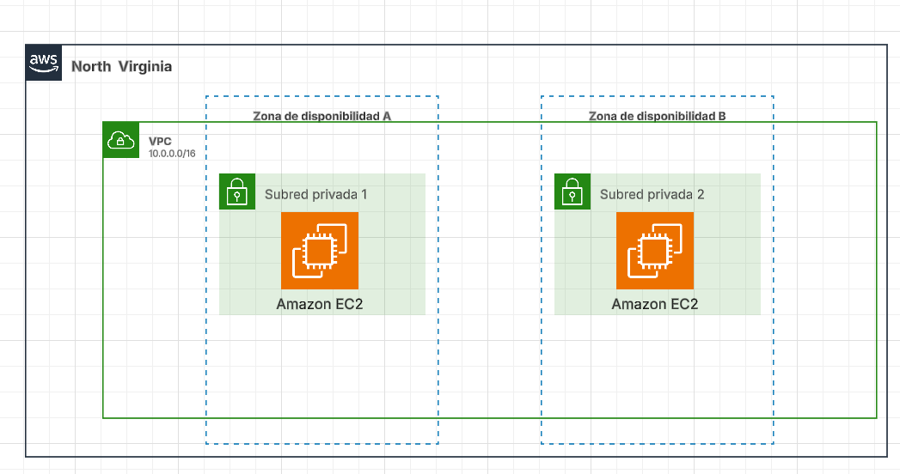

Ejercicio 1:
    
    En la topologia se puede ver como dentro de la region de North Virginia
    hay una vpc con 2 zonas de disponibilitat, que en cada una hay una subred con una instancia cada una.
    
    Y basicamente el ejercicio consiste en crear 2 instancias con terraform. 