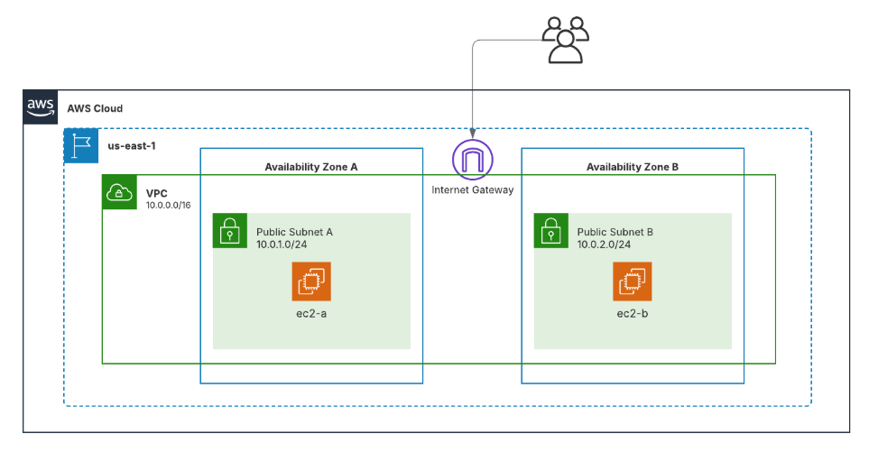

Exercici 1:
En aquest exercici creo una xarxa bàsica a AWS. 
Configuro la regió us-east-1, faig una VPC amb dues subxarxes públiques i un Internet Gateway per tenir connexió. 
Afegeixo un grup de seguretat que permet SSH i trànsit intern, i finalment inicio dues instàncies EC2, una a cada subxarxa, amb la clau vockey i dins del grup de seguretat.
